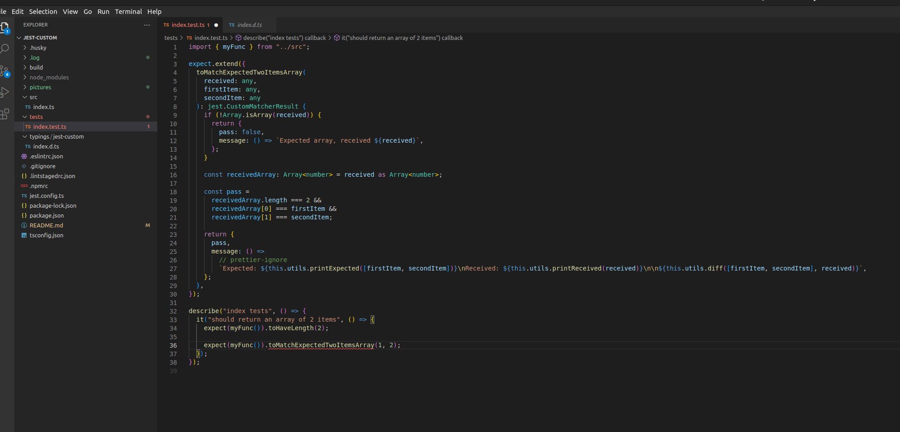
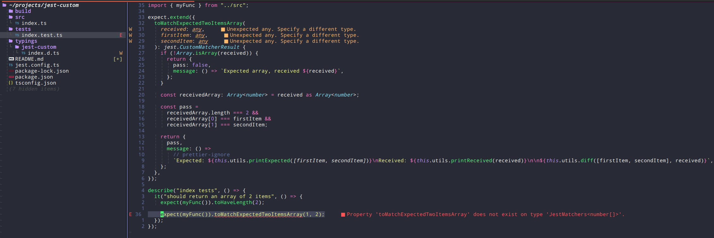

Demo of my issue with typescript server not detecting the custom jest types.

## how to?

```
npm i
code .
```

Then open tests/index.test.ts.

If reproduced, there should be an error "Property 'toMatchExpectedTwoItemsArray' does not exist on type 'JestMatchers<number[]>'.".

VS Code:


nvim


nvim configuration for tsserver:

```
require'lspconfig'['tsserver'].setup {
  on_attach = on_attach,
  flags = lsp_flags,
  capabilities = capabilities,

  -- debugging
  filetypes = {
    "javascript", "javascriptreact", "javascript.jsx", "typescript", "typescriptreact", "typescript.tsx", "json"
  },
  -- taken from
  -- https://github.com/neovim/nvim-lspconfig/blob/master/doc/lspconfig.txt
  -- https://github.com/typescript-language-server/typescript-language-server#initializationoptions
  init_options = {
    tsserver = {
      logDirectory = vim.fn.getcwd() .. "/.log/",
      -- logVerbosity?: 'off' | 'terse' | 'normal' | 'requestTime' | 'verbose';
      logVerbosity = "verbose",
      trace = "verbose"
    }
  }
}
```
